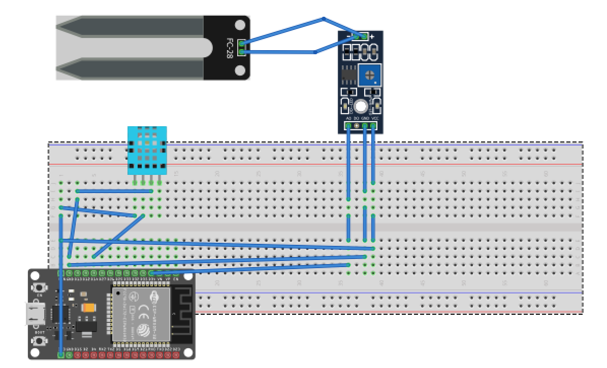

# 🌱 IoT Soil Moisture & DHT11 Project (ESP32)

This IoT project monitors **soil moisture** and **temperature & humidity** using ESP32, Soil Moisture Sensor (FC-28), and DHT11 sensor. Data can be sent to Blynk / MQTT / Thingspeak.

## 🔧 Components
- ESP32 DevKit V1
- Soil Moisture Sensor (FC-28)
- DHT11 Temperature & Humidity Sensor

## 📐 Circuit Diagram

## 💻 Code
Located in `/code/soil_temp_hum.ino`

## 🚀 Features
- Live soil moisture % reading
- Temperature & humidity monitoring
- IoT connectivity with Blynk
- Serial monitor Readings
- By Blynk App See a Dashboard In Mobile
  

